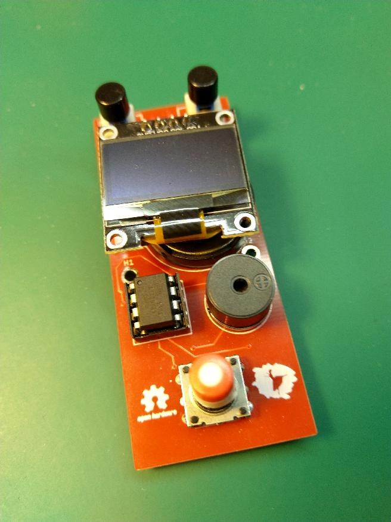
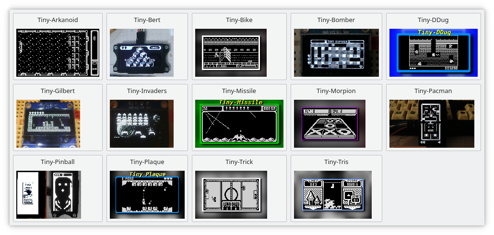
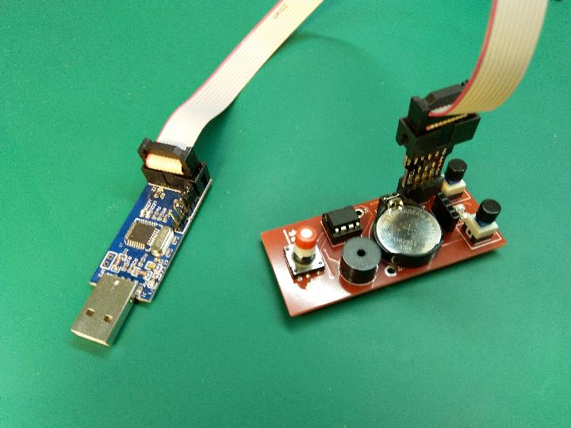
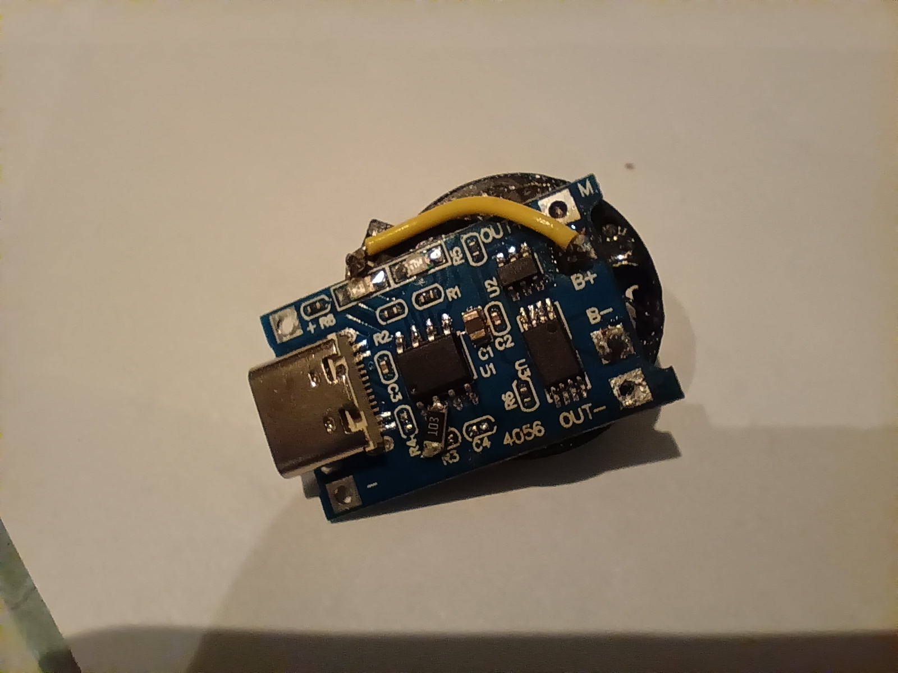
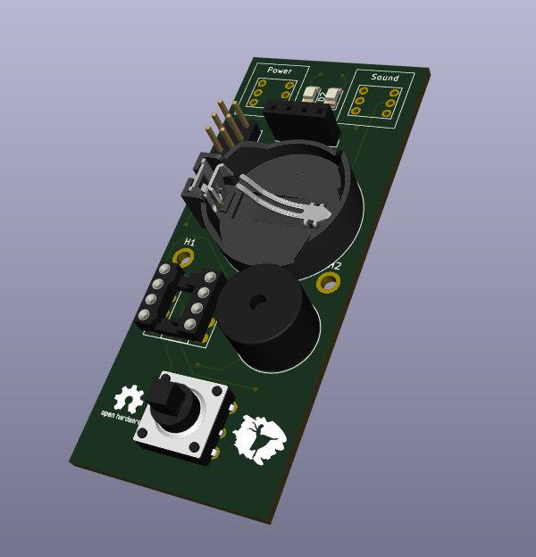
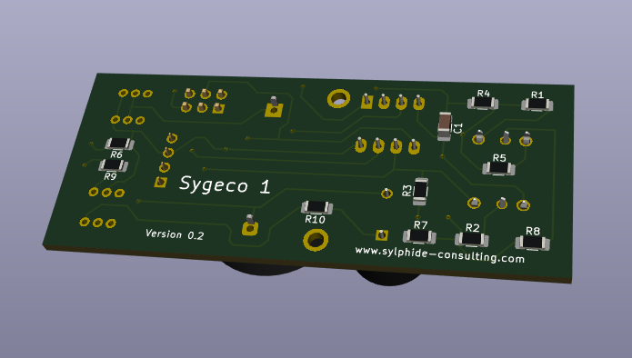
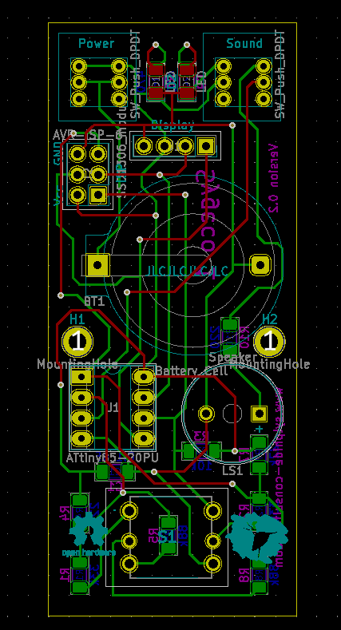
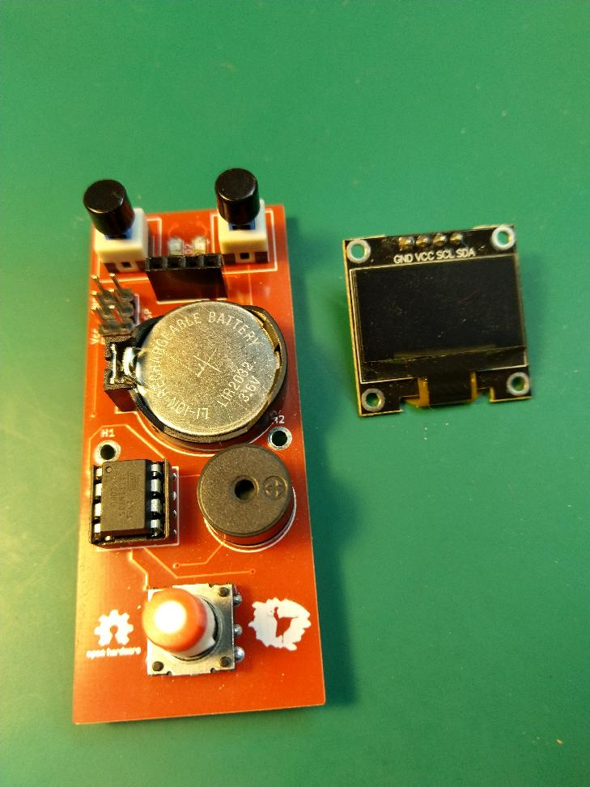

# Sygeco 1

There are several *implementations* of the tinyjoypad mini-console, but none **was** actually open, so I couldn't adapt/play with it.
This is my take on it. I also wrote a child-friendly interface to allow for changing the game (aka *flash new firmware*).

This is [open hardware](https://en.wikipedia.org/wiki/Open-source_hardware),
the PCB is designed with [KiCAD](https://en.wikipedia.org/wiki/KiCad]), and source files can be found on the
([mercurial](https://en.wikipedia.org/wiki/Mercurial)) repository at [https://freehackers.org/electronics/sygeco1](https://freehackers.org/electronics/sygeco1).

[ {: style="width:450px;display:block;margin:auto;"} ](overview.png)

# Introduction

The tinyjoypad is a fun exemple of how minimalist a *game console* can be. The schematic is so simple, that a breadboard photo is enough, and the software is open (arduino). That sounded great !

I had some (dip8) attiny85 around, as well as the very famous small oled display, so it was very quick to get the breadboard implementation working, and my children urging me to let them play on it. But, well, breadboard is not good for actual playing.

There *were* some PCB variations on the web, and even on [hackaday](https://hackaday.io/search?term=tinyjoypad). You could maybe get the gerbers, but not the schematics. Not as open as I would have liked. (I come from the software opensource community). 

I needed to learn how to make a PCB anyway, so here's my version. It has the following features:

* CR2032 holder for power supply. The console can support both usual cr2032 battery (~3V) and LiPo version (3.5~4.2 V). We use the LiPo battery and it's very useful. The console doesn't have any LiPo charging support though, you need an external charger.
* sound switch ( huge [waf](https://en.wikipedia.org/wiki/Wife_acceptance_factor) !)
* sound slightly lighter by lowering the voltage at audio speaker (again, huge waf !)
* 5-way joystick instead of tactile switches.
* standard ISP connector for changing games (flashing the MCU)

I also wrote a small application to easily change the game on the console.

I did that before I was aware of [this great project](https://github.com/Yevgeniy-Olexandrenko/tiny-handheld), which appeared at the same time. The end-result is pretty similar. The 'tiny handheld' also has audio switch and ISP, and most importantly, the schematic is available (based on EasyEDA). It features an eeprom, not sure why.

It should accept any 'game' made for the tinyjoypad, including those by the original author, and others. Yevgeniy Olexandrenko did a great job [gathering the binaries on his page](https://github.com/Yevgeniy-Olexandrenko/tiny-handheld/tree/master/software/games).

The project was developed using KiCAD, all files are on the repository (schematics, PCB, and final gerbers for printing).

## Launcher

On the repository, under the `launcher/` directory, you can find a quick PyQt-based interface that displays a grid of games, and will program the one you click on. You need to have `PyQt` installed (of course) and the ubiquitous `avrdude` programmer on the path. It's tested on Linux, but should work on any platform with `PyQt` and `avrdude` available. You can easily tweak the script to change the games list: you need a binary and an preview image for each game, all in the script directory. You may want to change the few messages displayed to 'users'.

[ {: style="width:450px;display:block;margin:auto;"} ](launcher.png)

## Programming

I use an `USBasp` programmer, but you can use anything you want. The connector on the board is extremely standard, and `avrdude` very probably support your programmer. Just configure the proper programmer at the top of the script.

[ {: style="width:450px;display:block;margin:auto;"} ](programming.png)

## Charging

For charging the LiPo button batteries, I use those very very cheap TP4056-based chargers you can find on chinese sites, with a battery holder soldered directly. The charging current is kinda configurable on those modules, and the default is suitable for normal batteries. Those LIR2306 are much smaller, so i've changed the configuration resistor from 1k to 10k (see the datasheet). Problem is, the resistor is some very very very small smd, and I only got HUGE 1206. I ended soldering it directly to one pin of the 4056. Once done,  it works perfectly.

[ {: style="width:450px;display:block;margin:auto;"} ](charger.png)

## Compilation

Compiling even the original exemples is tricky. Here are the information I would have liked to find somewhere.

The 'games' are actually arduino sketches. But arduino 'as is' doesn't support bare attiny85. You need to instal a package
(a [BSP](https://en.wikipedia.org/wiki/Board_support_package) actually).
The right one is [https://github.com/damellis/attiny](https://github.com/damellis/attiny).

Summary: you need to add an URL in `File/Preferences/AdditionalBoardsManager`, then select the righ package in menu `Tools/Board/Boards` Manager.
Then configure in the new menu appearing: first the "board" ("Attiny/25/45/85"), then the processor (85 obviously), and fnially the frequency ("Internal 16MHz").

That was the easy part. The tricky part is about the OLED driver. It's called 'ssd1306xled', but there are actually a lot of variations with this name. And most importantly, you'll find a library with such a name in the standard arduino packages manager. But this is not the right one. Using this standard one will create binaries very slightly bigger than the maximum size. Which is small, it's called 'tiny' for a reason.

The right one to use is [https://github.com/Defragster/ssd1306xled](https://github.com/Defragster/ssd1306xled), and
you can copy/clone this under your arduino libraries directory, bypassing the interface installer. On linux that means `~/.Arduino/libraries/`.

## Weird values for resistors

To detect keys, the tinyjoypad uses resistor dividers and the internal [ADC](https://en.wikipedia.org/wiki/Analog-to-digital_converter) of the MCU. One on each direction (left/right, and up/down).

If you look at the schematic, you'll notice that the resistors values are weird. We would typically expect something like this to allow for maximum tolerance:

* voltage < vpp/3 : one direction
* voltage > 2 \* vpp/3 : other direction
* otherwise no button is detected.

The reason for those strange values, which imho deserves an explanation, is that the left/right direction is wired to the PIN1 of the chip. The attiny85 is very limited on i/o, and we have to deal with the fact that pin1 is **also** the reset pin. If the voltage is too low (say, less than half vpp), the chip will reset/reboot. The good news is that if we stay on the upper half, we can still use the internal ADC, and that's what the original design takes advantage of. Hence those weird values..

## Challenges

Designing the schematic and PCB was ok. We enjoy having those small joystick-like inputs, usually called "5-way switches". The main problem was to find proper components. Most of them were obviously easy (resistors.. even the oled). But at this time I have yet to find a proper "cap" for the joystick. It uses a very common/typical square 3.2mm axle, for which you can find cheap cap on the market. But they are too long/deep. We still rely on cutting them with a knife, which is ... unfortunate.

## Bill of material

There's a `bom.fods` file on the repository, that you can open with `libreoffice`. The overall cost is about 6€. The heaviest parts, and also those that most hobbyists probably already have are the OLED display, the attiny85 and the battery. Without those parts, the cost is around 2€, including the PCB.

Things to be aware of:

* joystick / 5-way switches: I've used no-name chinese components, but I guess they are based on a standard one (probably the SKQUCAA010 from Alps or Alpine brand). All those found on internet have the same characterics, most importantly the footprint, so there's not real risk here. Just be sure to use the through-hole version, there exists a SMD one.
* OLED display: you can find them everywhere, but be careful that the wiring might be different. The PCB uses the (I think) most common one with pins in this order: `GND, VDD, SCK, SDA`. You can find them with different led colors, and my children enjoy being able to change the display color as they wish.

[ {: style="width:450px;display:block;margin:auto;"} ](3dview.png)

## Random notes

There are holes on the PCB to fix the oled display using 11/12mm standoffs + screws. Unfortunately, the OLED modules you find are all different on this regard. Even the few I have are not compatible, and yours will probably be different. Anyway, you need to remove the display for changing the battery or the game. The idea was to 'harden' it slightly so that it could be brought to school.

## Replicating

It's easy for you to replicate this project. The easiest way is to use the provided gerbers and use one of the common "PCB printing" services. The parts are all standard and easy to find.

I've used SMD components, but only the biggest ones (1206). If you know how to solder through-hole components, it really is not more difficult. It was the first time for me, and it went very well.

The PCB allows for both variant of the MCU: through-hole, and SMD. I choose the through-hole version of the joystick for machanical reasons.

I do not intend to provide kits on tindie or whatever. I have a few spare PCBs though, [contact me](https://freehackers.org/thomas/feedback/)
if interested, especially if you happen to live near Paris/France.

## Gallery

Some more photos and images:

[ {: style="width:450px;display:block;margin:auto;"} ](3dview.back.png)

[ {: style="width:450px;display:block;margin:auto;"} ](kicad_pcb.png)

[ {: style="width:450px;display:block;margin:auto;"} ](overview2.png)

